# A-ToMe: Adaptive and Disentangled Token Merging for Semantic Binding

**Authors:** Bhuvanashree Murugadoss, Ananya Sane, Achuth Chandrasekhar

[](https://drive.google.com/file/d/1SD892lWA6kgS7T-K78t6Yz__nQIqis2s/view?usp=drive_link) [](https://drive.google.com/file/d/1-WksneAvS1a2il3U9QRf76hh6shJa4Cw/view?usp=drive_link)

Semester-long course project guided by **Prof. Matt Gormley** as part of **10-623: Generative AI** at **Carnegie Mellon University**.

> Proposed A-ToMe, a training-free (post-training) token merging method for diffusion models, reducing semantic binding errors by disentangling content and filler tokens and preventing cross-attention leakage.

---

## Table of Contents
- [Overview](#overview)
- [Problem Statement](#problem-statement)
- [Baseline Solution: Token Merging (ToMe)](#baseline-solution-token-merging-tome)
- [Limitations of Baseline](#limitations-of-baseline-tome)
- [Our Method: A-ToMe](#our-method-a-tome)
- [Related Work and Gaps](#related-work-and-gaps)
- [Datasets](#datasets)
- [Results](#results)
- [Conclusion](#conclusion)
- [Technical Implementation Notes](#technical-implementation-notes)
- [Future Work](#future-work)

---

## Overview

A-ToMe is a novel approach to improving semantic binding in text-to-image generation models. It addresses the critical challenge of attribute leakage in multi-entity prompts, where modifiers (colors, textures) incorrectly bleed onto the wrong objects, causing visual contradictions and loss of semantic fidelity.

---

## Problem Statement

### The Challenge: Semantic Binding in Text-to-Image Generation

State-of-the-art models like SDXL degrade significantly on multi-entity prompts due to:

- **Attribute Leakage**: Modifiers (colors, textures) bleed onto incorrect objects
- **Visual Contradictions**: Loss of semantic fidelity in generated images
- **Multi-Entity Complexity**: Difficulty in binding attributes to their correct objects

**Example Failure Case:**
```
Prompt: "a dog wearing hat and a cat wearing sunglasses"
Result: SD3/SDXL fails to correctly bind accessories to the right animals
```

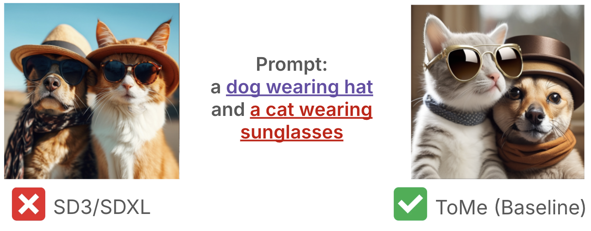
*Figure 1: Comparison showing how SDXL and SD3 struggle with attribute binding, while ToMe (baseline) provides better semantic binding.*

---

## Baseline Solution: Token Merging (ToMe)

ToMe is a training-free, inference-time optimization that enforces semantic binding by:

1. **Syntactic Parsing**: Uses SpaCy to identify dependency pairs (e.g., adjective-noun)
2. **Token Merging**: Aggregates embeddings into single composite tokens using element-wise summation
3. **Unified Attention**: Forces shared attention maps to lock attributes to specific objects
4. **Disentanglement**: Applies End Token Substitution (ETS) at the final step

### ToMe Pipeline

1. **Input & Parsing**: Parse prompt "A red dog and blue cat" → [(Red, Dog), (Blue, Cat)]
2. **Token Merging**: Combine related tokens to force shared attention
3. **Diffusion with Shared Attention**: Model generates attribute and object in the same spatial location
4. **Disentanglement & Generation**: Split tokens (ETS) to refine details and generate final pixels

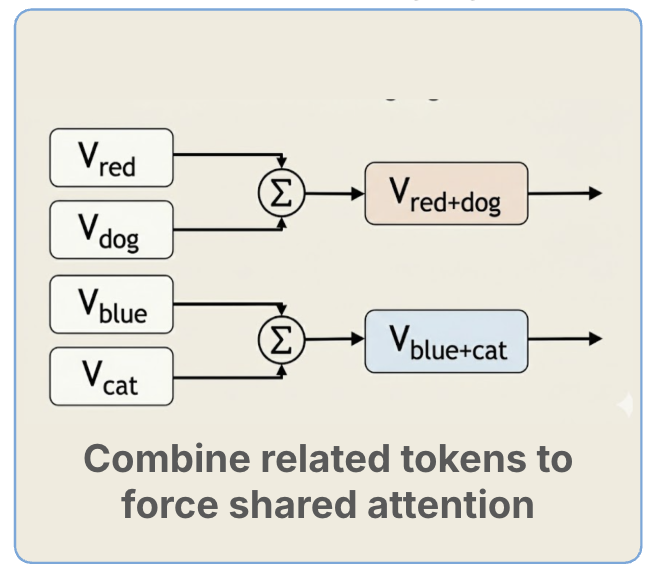

*Figure 2: Token merging process showing how V_red + V_dog → V_red+dog and V_blue + V_cat → V_blue+cat using element-wise summation (Σ).*

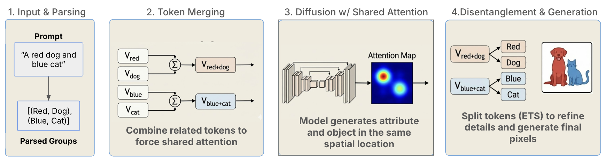
*Figure 3: Complete ToMe pipeline from input parsing through diffusion to final generation.*

---

## Limitations of Baseline (ToMe)

### 1. Naive Merging (Mathematical)
- **Flaw**: Uses simple summation (A + B)
- **Why it fails**: Treats semantic modifiers (e.g., "Red") and structural nouns (e.g., "Dog") as equal mathematical weights, causing stronger concepts to "wash out" weaker ones

### 2. Weak Parsing (Syntactic)
- **Flaw**: Relies on SpaCy statistical dependency parsing
- **Why it fails**: Breaks down on complex, multi-clause prompts (e.g., "A cat next to a dog that is wearing a hat"), leading to incorrect merge pairs

### 3. Coarse Disentanglement (Structural)
- **Flaw**: "End Token Substitution" swaps merged tokens abruptly
- **Why it fails**: Creates semantic leakage where attribute info remains mathematically coupled to object vectors

---

## Our Method: A-ToMe

### Algorithm 1: LLM-Based Parsing

**Improvement over baseline:** Semantic decomposition vs. syntactic parsing

- Uses quantized QWEN 2.5-14B to semantically decompose prompts into object-attribute groups
- Algorithmically aligns decomposition to the diffusion model's tokenization space
- **Example:**
  - Prompt: "a dog chasing a cat that is fluffy"
  - SpaCy (Baseline): `['a dog', 'a cat']`
  - LLM Parser (Ours): `['a dog', 'a fluffy cat']` ✓

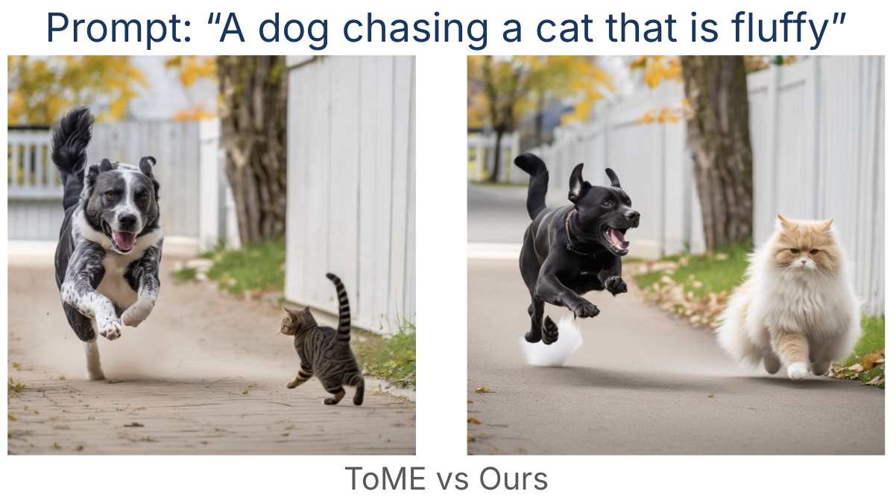
*Figure 4: SpaCy groups only "a dog" and "a cat", while LLM parser correctly identifies "a cat that is fluffy" as a single entity.*

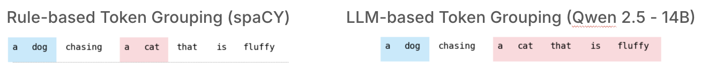
*Figure 5: Visual comparison showing how LLM-based parsing handles complex linguistic structures better than rule-based approaches.*

**Key Advantage:** Handles long-range dependencies, negation, and linguistic ambiguity

### Algorithm 2: Adaptive Weighting for Tokens

**Improvement over baseline:** Dynamic CFG-based weighting vs. fixed weights

- Derives merge coefficients from cross-attention weights
- Prioritizes semantically critical tokens inspired by Classifier-Free Guidance (CFG)
- Instead of treating all tokens equally (naive summation), weights are inference-time adaptive

**Mathematical Approach:**
- Baseline: Simple element-wise addition assumes all tokens equal
- A-ToMe: Dynamic weighting based on inference-time CFG signals

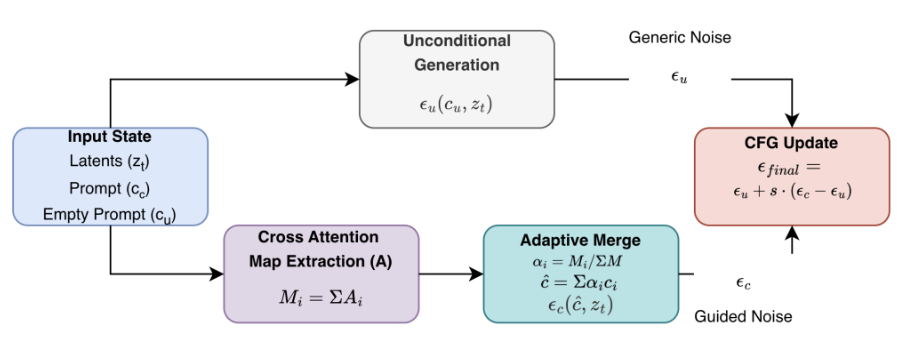
*Figure 6: Mathematical formulation of adaptive weighting using CFG-based merge coefficients.*

### Algorithm 3: Orthogonal Disentanglement

**Improvement over baseline:** Gram-Schmidt orthogonalization vs. token swapping

**Problem:** Overlapping embeddings → mixed semantics → reduced control accuracy

**Solution:** Gram-Schmidt Orthogonalization

**How It Works:**

For each token vector vᵢ:

1. **Remove projections** onto all previous orthogonal tokens:
   ```
   u = u - Σⱼ₌₁ⁱ⁻¹ proj_orthogonal[j](u)
   ```

2. **Compute orthogonal projection:**
   ```
   proj_u(v) = (v·u / ||u||²) × u
   where:
     v·u = dot product (measures semantic overlap)
     ||u||² = squared L2 norm of u
   ```

3. **Normalize and preserve magnitude:**
   ```
   u_orthogonal = (u / ||u||) × ||vᵢ||
   ```

**Result:** Each token becomes orthogonal to all previous tokens
- Dot product uᵢ · uⱼ = 0 for all i ≠ j (mutual orthogonality)
- Each token's vector encodes disentangled, non-interfering meaning

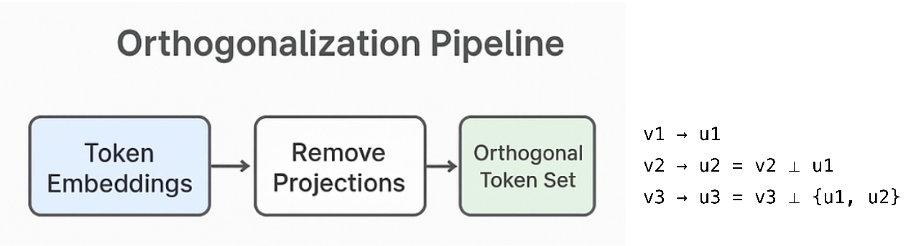
*Figure 7: Visual representation of the Gram-Schmidt orthogonalization process showing how token vectors become mutually orthogonal.*

**Example for 3 tokens:**
- Token 1: u₁ = v₁ (no change, first token)
- Token 2: u₂ = v₂ - proj_u₁(v₂) (becomes orthogonal to u₁)
- Token 3: u₃ = v₃ - proj_u₁(v₃) - proj_u₂(v₃) (orthogonal to both u₁ and u₂)

### Contribution 4: ComplexBind-50 ⭐ Our Adversarial Benchmark

To rigorously evaluate all three algorithms under real-world failure conditions, we constructed **ComplexBind-50** — an original hand-crafted benchmark designed to break syntactic parsers and expose attribute binding failures.

- **50 adversarial prompts** across three categories: long-range dependencies, negation/exclusion, and linguistic ambiguity
- Prompts are intentionally structured to fail SpaCy's dependency parser, isolating the advantage of LLM-based parsing
- Evaluated using **BLIP-VQA accuracy** as the scoring metric
- Available in this repo under [`complex_bind/`](complex_bind/)

**Example prompts:**
- `"A dog chasing a cat that is fluffy"` — tests long-range modifier attachment
- `"A futuristic city with no flying cars"` — tests negation handling
- `"A white fluffy cat on the left and a black labrador dog on the right, both facing the camera"` — tests multi-attribute, multi-entity binding

---

## Related Work and Gaps

| Gap Identified | Baseline (ToMe) | Proposed (A-ToMe) | Key Related Works |
|----------------|-----------------|-------------------|-------------------|
| **Token Merging**: Uniform weighting dilutes semantic precision | Naive Summation: Element-wise addition assumes all tokens equal | Adaptive-Weighted: Dynamic weighting based on inference-time CFG signals | Importance-Guided Token Merging; CFG Analysis |
| **Parsing**: Syntactic parsers fail on ambiguity | SpaCy Dependency: Brittle grouping based on syntax | LLM Semantic: Zero-shot decomposition into Entities & Attributes | LLM-Grounded Diffusion; DiffusionGPT |
| **Disentanglement**: Token swapping causes info coupling | End Token Sub (ETS): Coarse swapping of global tokens | Orthogonal Projection: Vector-level removal of conflicting semantics | Harmonizing Embeddings; DECOR |

---

## Datasets

### T2I-CompBench

A dataset designed for open-world compositional generation evaluation.

- **Size**: 6,000 compositional text prompts
- **Categories**: 
  - Attribute Binding
  - Object Relationships
  - Complex Compositions

**Focus Area:** Attribute Binding category, subdivided into:
- Color binding
- Shape binding
- Texture binding

### ComplexBind-50 ⭐ Our Benchmark

> **ComplexBind-50 is an original adversarial benchmark we constructed** to stress-test semantic binding under conditions where standard syntactic parsers fail. It is included in this repo under [`complex_bind/`](complex_bind/).

Prompts are hand-crafted to expose failure modes of rule-based parsing and attribute binding, covering three adversarial categories:

**Adversarial Test Cases:**

1. **Long Range Dependencies**
   - Dependency parsers can "drop" earlier modifiers in complex lists
   - Example: "A white fluffy cat on the left and a black labrador dog on the right, both facing the camera"

2. **Negation and Exclusion**
   - Standard pipelines struggle with negated concepts
   - Example: "A futuristic city with no flying cars"

3. **Linguistic Ambiguity**
   - Parsers struggle to resolve semantic ambiguity without context
   - Example: "A dog chasing a cat that is fluffy"

---

## Results

### Qualitative Comparisons

#### LLM-Based Parsing (Algorithm 1)
**Prompt:** "A dog chasing a cat that is fluffy"

| ToMe (Baseline) | A-ToMe (Ours) |
|:---------------:|:-------------:|
| 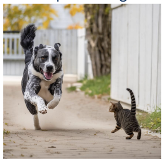 | 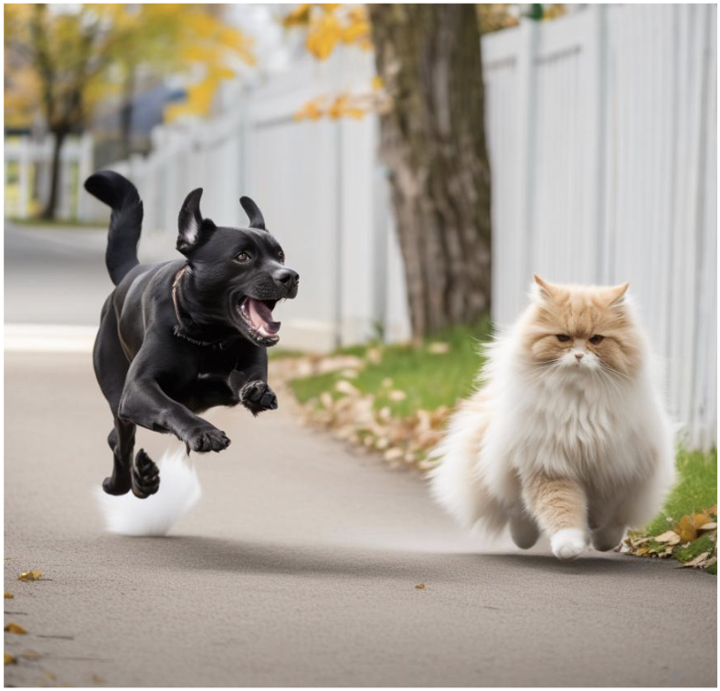 |

*Figure 9: ToMe shows incorrect attribute binding, while A-ToMe correctly binds "fluffy" to the cat.*

#### Adaptive Weighting (Algorithm 2)
**Prompt:** "A knitted car"

| ToMe (Baseline) | A-ToMe (Ours) |
|:---------------:|:-------------:|
|  |  |

*Figure 10: ToMe produces weak texture application, while A-ToMe achieves strong, accurate texture binding.*

#### Orthogonal Disentanglement (Algorithm 3)
**Prompt:** "A blue backpack and a brown cow"

| ToMe (Baseline) | A-ToMe (Ours) |
|:---------------:|:-------------:|
| 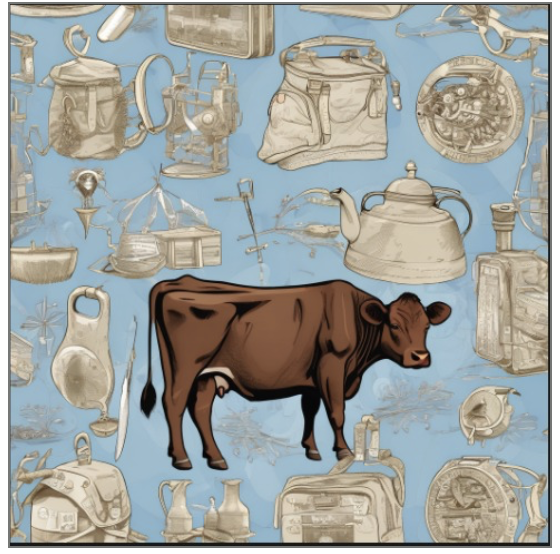 |  |

*Figure 11: ToMe shows color leakage between objects, while A-ToMe achieves clean color separation.*

**Prompt:** "A white fluffy cat on the left and a black labrador dog on the right, both facing the camera"

| ToMe (Baseline) | A-ToMe (Ours) |
|:---------------:|:-------------:|
| 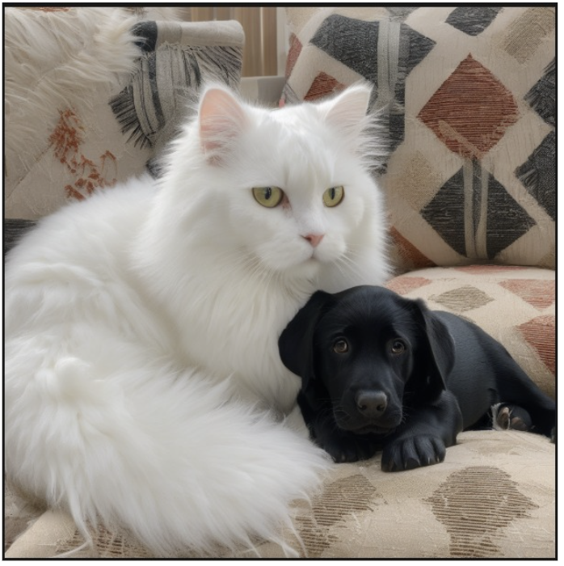 | 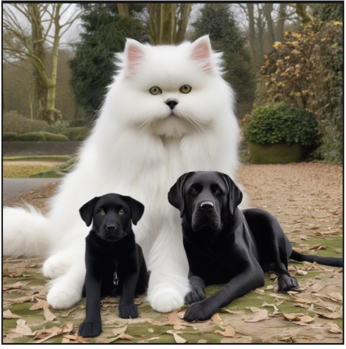 |

*Figure 12: Complex multi-attribute binding showing ToMe's attribute confusion vs. A-ToMe's correct binding.*

### Quantitative Results

#### T2I-CompBench Performance

**Key Finding:** Only Algorithm 3 (Orthogonal Disentanglement) reliably improves ToMe on T2I-CompBench. Combining all modules together hurts accuracy.

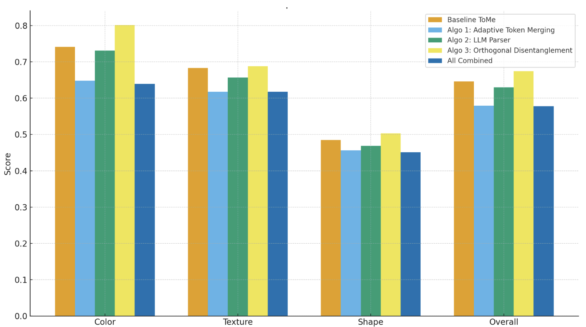

*Figure 13: Combined comparison of all methods across Color, Texture, Shape, and Overall metrics. The chart shows:*
- **Baseline ToMe** (Orange): Consistent performance across categories
- **Algo 1: Adaptive Token Merging** (Light Blue): Mixed performance
- **Algo 2: LLM Parser** (Green): Comparable to baseline
- **Algo 3: Orthogonal Disentanglement** (Yellow): Best performance, especially on Color binding
- **All Combined** (Dark Blue): Degraded performance when all modules combined

**Performance Breakdown:**
- **Color**: Algo 3 achieves ~0.80 (best), vs. ToMe baseline ~0.74
- **Texture**: Algo 3 shows ~0.69, slight improvement over baseline ~0.68
- **Shape**: Algo 3 reaches ~0.50, best among all methods
- **Overall**: Algo 3 leads at ~0.67, while "All Combined" drops to ~0.57

#### ComplexBind-50 Performance (Our Benchmark)

Evaluated on our own adversarial benchmark — prompts designed to break syntactic parsers via long-range dependencies, negation, and linguistic ambiguity. Scored using BLIP-VQA accuracy.

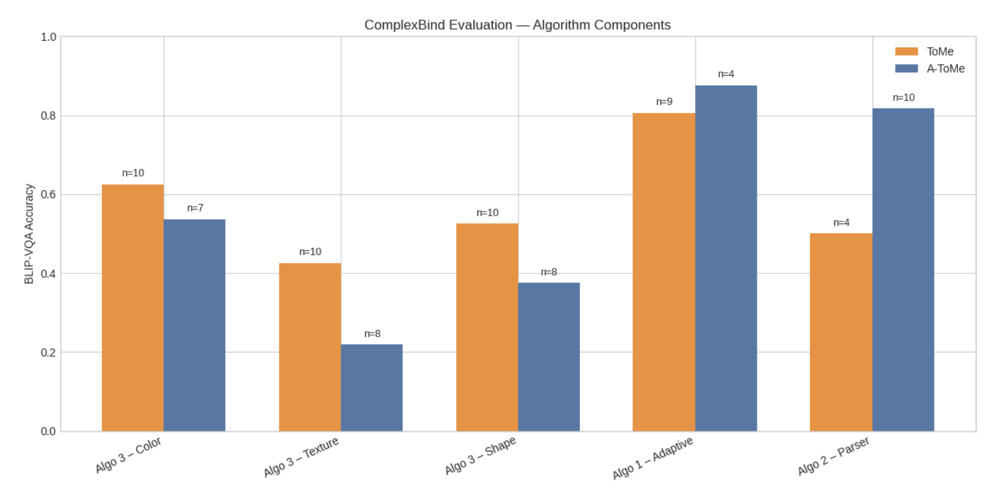

*Figure 14: BLIP-VQA Accuracy on ComplexBind-50 (our benchmark) across algorithm components (n = sample size):*

**Key Findings:**
- **Algo 3 (Color)**: ToMe outperforms (0.62, n=10) vs. A-ToMe (0.54, n=7)
- **Algo 3 (Texture)**: ToMe significantly stronger (0.43, n=10) vs. A-ToMe (0.22, n=8)
- **Algo 3 (Shape)**: ToMe leads (0.52, n=10) vs. A-ToMe (0.38, n=8)
- **Algo 1 (Adaptive)**: A-ToMe excels (0.88, n=4) vs. ToMe (0.80, n=9)
- **Algo 2 (Parser)**: A-ToMe dominates (0.82, n=10) vs. ToMe (0.50, n=4)

**Critical Insight:** Under adversarial prompts, ToMe outperforms A-ToMe on Algorithm 3 tasks, while A-ToMe remains stronger on Algorithm 1 and Algorithm 2. Improvements seen on clean benchmarks do not transfer uniformly to harder, real-world conditions.

---

## Conclusion

A-ToMe demonstrates that targeted improvements to specific components of the token merging pipeline can enhance semantic binding:

1. **LLM-based parsing** handles complex linguistic structures better than syntactic parsers
2. **Adaptive weighting** provides more nuanced token importance than naive summation
3. **Orthogonal disentanglement** reduces semantic leakage more effectively than token substitution

However, results reveal important limitations:
- Not all improvements transfer to adversarial conditions
- Combining all modules together can degrade performance
- Trade-offs exist between different algorithmic approaches

---

## Technical Implementation Notes

- **Training-free**: All improvements are inference-time optimizations
- **LLM Used**: QWEN 2.5-14B (quantized)
- **Base Model**: Works with SDXL and SD3
- **Dependency Parser**: SpaCy (baseline comparison)
- **Mathematical Framework**: Gram-Schmidt orthogonalization for disentanglement

---

## Future Work

The adversarial dataset results suggest several directions:

1. Understanding why combined modules underperform on T2I-CompBench
2. Improving robustness on adversarial prompts while maintaining clean benchmark performance
3. Investigating the trade-offs between different algorithmic components
4. Exploring hybrid approaches that adapt based on prompt complexity